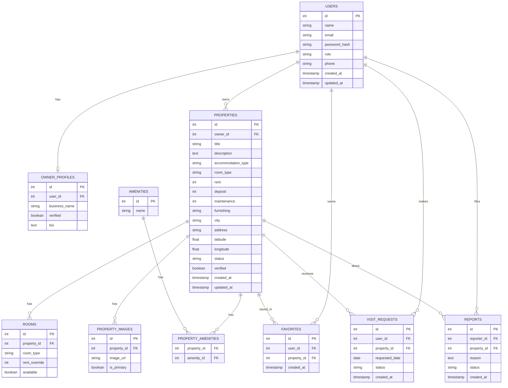

# SmartStay — Entity Relationship Diagram

This diagram represents the core database schema for SmartStay, as designed in Phase 4.

## Notes

- **users** is the shared base table for all roles (tenant, owner, admin), distinguished by the `role` field.
- **owner_profiles** extends `users` with owner-specific fields, only populated when `role = 'owner'`.
- **property_amenities** is a join table implementing the many-to-many relationship between `properties` and `amenities`.
- Admin does not have a dedicated table for now — the `role = 'admin'` flag on `users` is sufficient.
- All foreign keys reference the primary key of their related table (e.g. `owner_id` in `properties` references `users.id`).